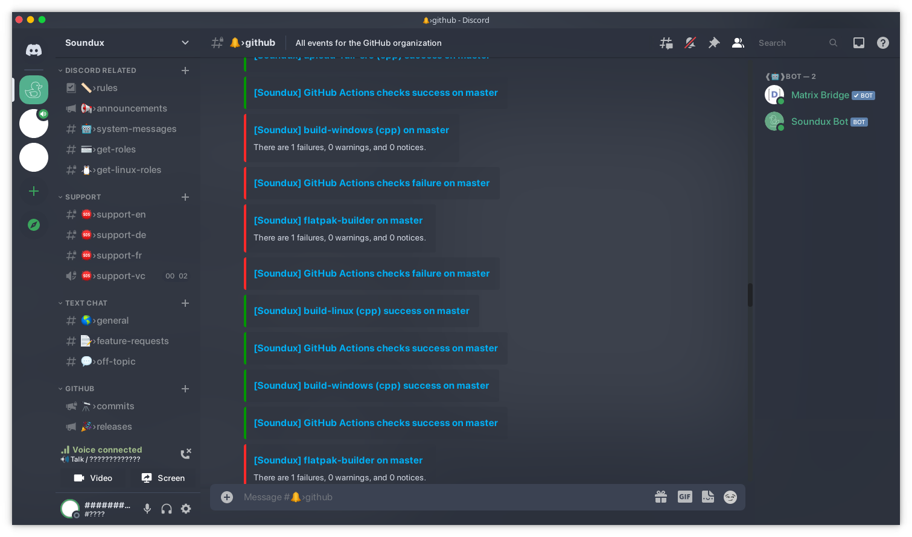

<h2> ❄️ Nordic Glass ❄️ </h2>

A Discord Nord Theme with Transparency in mind!

# 🔍 Transparency

If you use powercord it is recommended to enable transparency.  
You can find the transparency setting under:

- User Settings
  - Power Cord
    - General Settings
      - Transparent Window